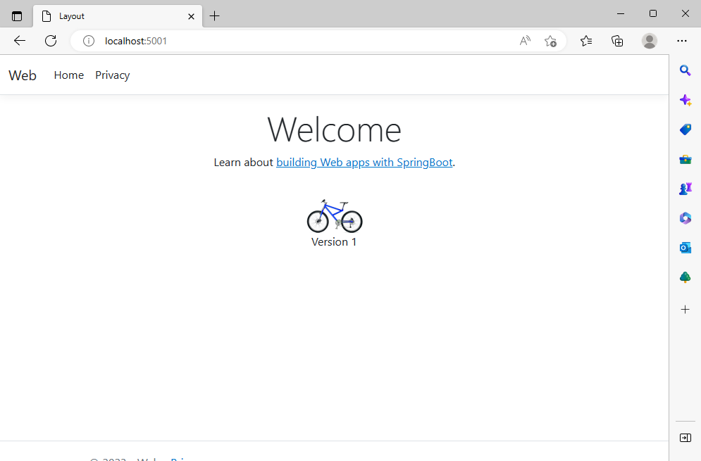
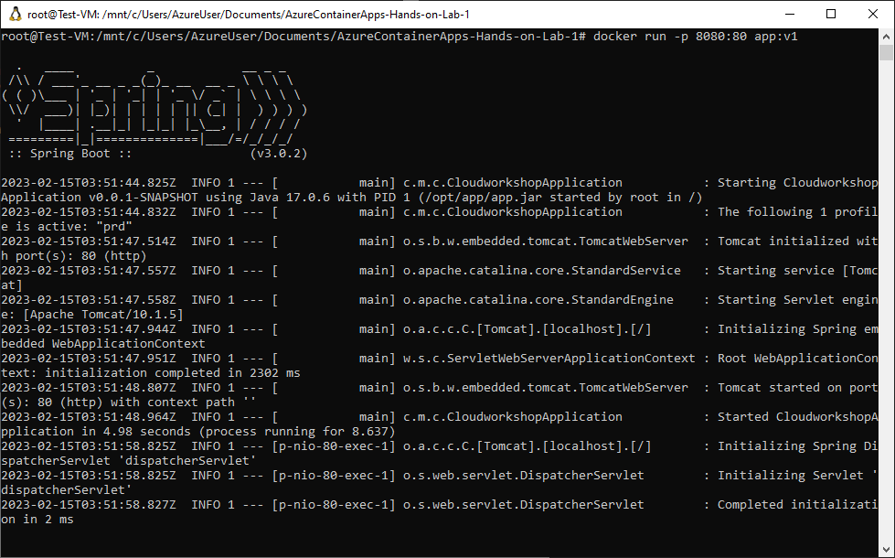
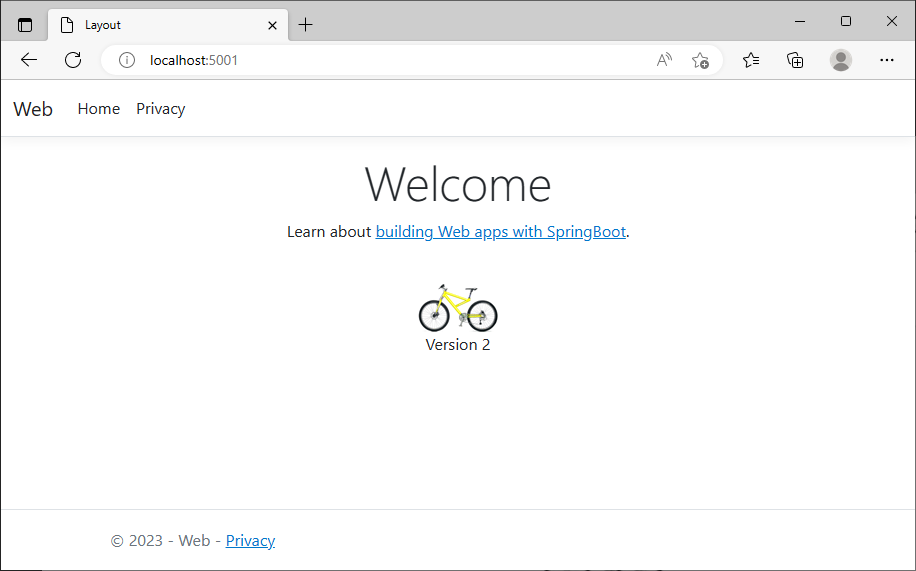

Azure Container Hands-on lab  
Mar. 2023

<br />

### Contents

- [開発環境の準備](#開発環境の準備)

  - [Task 1: リポジトリのフォーク](#task-1-リポジトリのフォーク)

  - [Task 2: Git の初期構成](#task-2-git-の初期構成)

  - [Task 3: 開発環境へのリポジトリのクローン](#task-3-開発環境へのリポジトリのクローン)

- [Exercise 1: Docker イメージの構築と実行](#exercise-1-docker-イメージの構築と実行)

  - [Task 1: ローカルでのアプリケーションの実行](#task-1-ローカルでのアプリケーションの実行)

  - [Task 2: 公開用ビルドのファイル セットの発行](#task-2-公開用ビルドのファイル-セットの発行)

  - [Task 3: Docker ファイルの作成](#task-3-docker-ファイルの作成)

  - [Task 4: Docker イメージの構築](#task-4-docker-イメージの構築)

  - [Task 5: イメージからコンテナーを起動](#task-5-イメージからコンテナーを起動)

- [Exercise 2: Azure Container Registry の作成とイメージのプッシュ](#exercise-2-azure-container-registry-の作成とイメージのプッシュ)

  - [Task 1: Azure Container Registry の作成](#task-1-azure-container-registry-の作成)

  - [Task 2: イメージをレジストリへプッシュ](#task-2-イメージをレジストリへプッシュ)

- [Exercise 3: Azure Container Apps の作成とイメージの展開](#exercise-3-azure-container-apps-の作成とイメージの展開)

  - [Task 1: コンテナー アプリの作成](#task-1-コンテナー-アプリの作成)

  - [Task 2: コンテナー レジストリからのイメージ取得](#task-2-コンテナー-レジストリからのイメージ取得)

- [Exercise 4: Azure Container Apps の設定](#exercise-4-azure-container-apps-の設定)

  - [Task 1: リビジョン モードの設定](#task-1-リビジョン-モードの設定)

  - [Task 2: アプリケーションの更新](#task-2-アプリケーションの更新)

  - [Task 3: 新しいリビジョンの展開](#task-3-新しいリビジョンの展開)

  - [Task 4: コンテナー アプリのスケーリング](#task-4-コンテナー-アプリのスケーリング)

- [Exercise 5: CI/CD を使用したコンテナー アプリの展開](#exercise-5-cicd-を使用したコンテナー-アプリの展開)

  - [Task 1: サービス プリンシパルの作成](#task-1-サービス-プリンシパルの作成)

  - [Task 2: 資格情報の GitHub リポジトリへの保存](#task-2-資格情報の-github-リポジトリへの保存)

  - [Task 3: Dockerfile とアプリケーションの更新](#task-3-dockerfile-とアプリケーションの更新)

  - [Task 4: ワークフローの実行](#task-4-ワークフローの実行)

  - [Task 5: リビジョンの管理](#task-5-リビジョンの管理)

- [Exercise 6: Microsoft Security DevOps GitHub Actions の構成](#exercise-6-microsoft-security-devops-github-actions-の構成)

  - [Task 1: Microsoft Defender for DevOps の有効化](#task-1-microsoft-defender-for-devops-の有効化)

  - [Task 2: ワークフロー権限の変更](#task-2-ワークフロー権限の変更)

  - [Task 3: ワークフローとアプリケーションの更新](#task-3-ワークフローとアプリケーションの更新)

  - [Task 4: ワークフローの実行とスキャン結果の確認](#task-4-ワークフローの実行とスキャン結果の確認)

<br />

## 開発環境の準備


### Task 1: リポジトリのフォーク

- Web ブラウザを起動し、[ワークショップのリポジトリ](#https://github.com/kohei3110/AzureContainerApps-Hands-on-Lab-1)へ移動

- 画面右上の Fork をクリック

  

- 自身のアカウントにリポジトリが複製されていることを確認

<br />

### Task 2: Git の初期構成

- [Azure ポータル](#https://portal.azure.com)へアクセス

- 事前展開済みの仮想マシンの管理ブレードへ移動し、「**接続**」-「**Bastion**」を選択

  

- ユーザー名、パスワードを指定し、仮想マシンへ接続

  

- 新しいタブで仮想マシンへの接続を行い、デスクトップ画面が表示

- Visual Studio Code を起動 (デスクトップ上の準備されたショートカットをダブルクリック)

- "**Terminal**" - "**New Terminal**" を選択し、ターミナルを表示

  

- Git の初期設定を実行

  - ユーザー名の設定

    ```
    git config --global user.name "User Name"
    ```

    ※ User Name を自身の名前に変更

  - Email アドレスの設定

    ```
    git config --global user.email "Email@Address"
    ```

    ※ {Email Address} を使用するメール アドレスに変更

  - 設定値の確認

    ```
    git config --list --global
    ```

    ※ 設定したユーザー名・メール アドレスが出力されたら OK

<br />

### Task 3: 開発環境へのリポジトリのクローン

- Web ブラウザで Fork したリポジトリの "**Code**" をクリック

  表示されるツール チップよりリポジトリの URL をコピー

  

- Visual Studio Code のサイドバーから Explorer を選択し "**Clone Repository**" をクリック

  

- リポジトリの URL の入力を求められるためコピーした URL を貼り付け Enter キーを押下

  

- 複製先となるローカル ディレクトリ (Documents) を選択

  GitHub の認証情報が求められる場合は、アカウント名、パスワードを入力し認証を実施

- 複製されたリポジトリを開くかどうかのメッセージが表示されるので "**Open**" をクリック

- Explorer に複製したリポジトリのディレクトリ、ファイルが表示

  ```
  git remote -v
  ```

  ※ **クローン先の GitHub URL が出力されたら OK (<自分のアカウント名>/AzureContainerApps-Hands-on-Lab-1 になっていることを確認 (kohei3110/AzureContainerApps-Hands-on-Lab-1になっていないことを確認)** 

<br />

## Exercise 1: Docker イメージの構築と実行

### Task 1: ローカルでのアプリケーションの実行

<details>
  <summary>C#</summary>

- Visual Studio Code で "**Terminal**" - "**New Terminal**" を選択

- ASP.NET Core プロジェクトのディレクトリへ移動

  ```
  cd src/CS/Web
  ```

- アプリケーションを実行

  ```
  dotnet run
  ```

- ターミナルに表示されるアプリケーションの URL を Ctrl キーを押しながらクリック

  

- Web ブラウザが起動し、アプリケーションのトップ画面が表示

  

- ターミナルで Ctrl + C を押下し、アプリケーションの実行を終了
</details>

<details>
  <summary>Java</summary>

- Visual Studio Code で "**Terminal**" - "**New Terminal**" を選択

- SpringBoot プロジェクトのディレクトリへ移動

  ```
  cd src/Java/Web
  ```

- アプリケーションを実行

  ```
  ./mvnw spring-boot:run
  ```

  - ※Spring-Boot のプラグインがインストールしてある場合はつぎの手順でも実行可能。

    1. Visual Studio Code で src/Java/Web/src/main/com/microsoft/cloudworkshop/CloudworkshopApplication.java を**ダブルクリック**で開く。しばらく待つと下図のように main メソッドの上部に「Run|Debug」が表示される

    

    2. main メソッドの上に表示された Run をクリック。

- 起動したらブラウザで http://localhost:5001 にアクセス

- アプリケーションのトップ画面が表示

  

- ターミナルで Ctrl + C を押下し、アプリケーションの実行を終了

</details>

<br />

### Task 2: 公開用ビルドのファイル セットの発行

<details>
  <summary>C#</summary>

- ターミナルでコマンドを実行し、展開のためのファイル セットをディレクトリへ発行

  ```
  dotnet publish -c Release -o ./bin/Publish
  ```

- bin フォルダ内に Publish フォルダが生成され、アプリケーションとその依存関係が発行されていることを確認

  

</details>

<details>
  <summary>Java</summary>

- Visual Studio Code で "**Terminal**" - "**New Terminal**" を選択

- SpringBoot プロジェクトのディレクトリへ移動

  ```
  cd src/Java/Web
  ```

- パッケージ作成

  ```
  ./mvnw package
  ```

- target フォルダ内に jar ファイルが生成されていることを確認

  

</details>

<br />

### Task 3: Docker ファイルの作成

<details>
  <summary>C#</summary>

- Visual Studio Code の Explorer で "**.docker**" - "**CS**" を展開し "**dockerfile** を選択

  

- エディタ画面で編集

  9 行目に先の手順で発行したファイル セットをコピーする操作を追加

  ```
  COPY ./src/CS/Web/bin/Publish .
  ```

- 「**File**」メニューの「**Save**」を選択し、ファイルを保存

</details>

<details>
  <summary>Java</summary>

- Visual Studio Code の Explorer で "**.docker**" - "**Java**" を展開し "**dockerfile** を選択

  

- エディタ画面で編集

  8 行目に先の手順で発行した jar ファイルをコピーする操作を追加

  ```
  COPY src/Java/Web/target/*.jar /opt/app/app.jar
  ```

- 「**File**」メニューの「**Save**」を選択し、ファイルを保存

</details>

<br />

### Task 4: Docker イメージの構築

- デスクトップ上の "**Ubuntu**" ショートカットをダブルクリック

- 操作用のプロンプトが起動

- WSL で Windows 側のマウントされたディレクトリへ移動

  ```
  cd /mnt/c/Users/AzureUser/Documents/AzureContainerApps-Hands-on-Lab-1
  ```

- docker build コマンドを実行しイメージを構築

  <details>
    <summary>C#</summary>

  ```
  docker build -t app:v1 -f .docker/CS/dockerfile .
  ```

  ※ コマンドのオプション

  - **-t**: 名前とタグを **名前:タグ** の形式で指定

  - **-f**: dockerfile のパスを指定

    

  - docker images コマンドを実行し、構築されたイメージが表示されることを確認

  ```
  docker images
  ```

    

  </details>

  <details>
    <summary>Java</summary>
    
    ```
    docker build -t app:v1 -f .docker/Java/dockerfile .
    ```

  ※ コマンドのオプション

  - **-t**: 名前とタグを **名前:タグ** の形式で指定

  - **-f**: dockerfile のパスを指定

    

  - docker images コマンドを実行し、構築されたイメージが表示されることを確認

  ```
  docker images
  ```

    

  </details>

<br />

### Task 5: イメージからコンテナーを起動

<details>
  <summary>C#</summary>

- docker run コマンドを実行し、作成したイメージからコンテナーを起動

  ```
  docker run -p 8080:80 app:v1
  ```

  ※ コマンドのオプション

  - **-p**: ポート マッピング（コンテナーの 80 番ポートを 8080 番ポートへマッピング）

  

- Web ブラウザを起動し http://localhost:8080 へアクセス

  

- 操作用のプロンプトで Ctrl + C キーを押下し、アプリケーションを終了

</details>

<details>
  <summary>Java</summary>

- docker run コマンドを実行し、作成したイメージからコンテナーを起動

  ```
  docker run -p 8080:80 app:v1
  ```

  ※ コマンドのオプション

  - **-p**: ポート マッピング（コンテナーの 5001 番ポートを 8080 番ポートへマッピング）

  

- Web ブラウザを起動し http://localhost:8080 へアクセス

  

- 操作用のプロンプトで Ctrl + C キーを押下し、アプリケーションを終了
</details>

- コンテナー一覧を表示するコマンドを実行

  ```
  docker ps -a
  ```

  ※ コマンドのオプション

  - **-a**: 起動中・停止中を含め、すべてのコンテナを表示（Java の場合は COMMAND の内容が異なる）

  

- 再度、イメージからコンテナーを起動

  ```
  docker run -d --rm -p 8080:80 app:v1
  ```

  ※コマンドのオプション

  - **-d**: デタッチド モードでコンテナを起動

  - **--rm**: コンテナ終了時にコンテナを削除

  - **-p**: ポート マッピング（コンテナの 80 番ポートを 8080 番ポートへマッピング）

  

- 起動中のコンテナーを確認

  ```
  docker ps
  ```

  

  ※ CONTAINER ID を確認

- Web ブラウザを起動し http://localhost:8080 へアクセス

- コンテナーを停止 (docker ps コマンドで確認した CONTAINER ID を指定)

  ```
  docker stop <CONTAINER ID>
  ```

- コンテナー一覧を表示するコマンドを実行

  ```
  docker ps -a
  ```

  ※ 2 度目に実行したコンテナーが表示されないことを確認

- 停止中のコンテナーを削除 (1 度目に実行したコンテナを削除)

  ```
  docker rm <CONTAINER ID> -f
  ```

  

- コンテナー一覧を表示するコマンドを実行

  ```
  docker ps -a
  ```

  ※ コンテナーが表示されないことを確認

<br />

## Exercise 2: Azure Container Registry の作成とイメージのプッシュ


### Task 1: Azure Container Registry の作成

- Web ブラウザで [Azure ポータル](#https://portal.azure.com)へアクセス

- ポータルのトップ画面で「**+ リソースの作成**」をクリック

  

- 左側のメニューで「**コンテナー**」を選択し、「**Container Registry**」の「**作成**」をクリック

  

- コンテナー レジストリの作成

  - 「**基本**」

    - **プロジェクト詳細**

      - **サブスクリプション**: ワークショップで使用するサブスクリプション

      - **リソース グループ**: ワークショップで使用するリソース グループ

    - **インスタンスの詳細**

      - **レジストリ名**: 任意 (英大文字小文字、数字のみで 5 から 50 文字)

      - **場所**: 任意

      - **SKU**: Standard

      

  - 「**ネットワーク**」

    - **接続の構成**: パブリック アクセス (すべてのネットワーク)

      

      ※ Premium SKU 選択時のみ構成可

  - 「**暗号化**」

    - **カスタマー マネージド キー**: 無効

      

      ※ Premium SKU 選択時のみ構成可

- 「**確認および作成**」をクリックし、指定した内容を確認後、「**作成**」をクリック

  

<br />

### Task 2: イメージをレジストリへプッシュ

- Azure ポータルで作成したコンテナー レジストリの管理ブレードへアクセス

- 左側のメニューから「**アクセス キー**」を選択

- 「**管理者ユーザー**」を有効化

  

- 操作用のプロンプトでレジストリへログイン

  ```
  docker login yourregistry.azurecr.io
  ```

  ※ yourreregistry.azurecr.io を作成したコンテナー レジストリのログイン サーバーに変更

  ※ コンテナー レジストリのログイン サーバー名は管理ブレードのアクセス キーから確認可

- Username, Password を指定し、ログインを実行

  ※ コンテナー レジストリの管理ブレードのアクセス キーから取得できるユーザー名とパスワードを使用

- レジストリへの完全修飾パスを使用して、イメージのエイリアスを作成

  ```
  docker tag app:v1 yourregistry.azurecr.io/app:v1
  ```

  ※ yourreregistry.azurecr.io を作成したコンテナー レジストリのログイン サーバーに変更

- エイリアスを付与したイメージが表示されることを確認

  ```
  docker images
  ```

  

- docker push を使用してレジストリへプッシュ

  ```
  docker push yourregistry.azurecr.io/app:v1
  ```

  ※ yourreregistry.azurecr.io を作成したコンテナー レジストリのログイン サーバーに変更

  

- Azure ポータルで作成したコンテナー レジストリの管理ブレードへアクセス

- 左側のメニューから「**リポジトリ**」を選択

- リポジトリ内のイメージを確認

  

<br />

## Exercise 3: Azure Container Apps の作成とイメージの展開


### Task 1: コンテナー アプリの作成

- Web ブラウザで [Azure ポータル](#https://portal.azure.com)へアクセス

- ポータルのトップ画面で「**+ リソースの作成**」をクリック

  

- 左側のメニューで「**コンテナー**」を選択し、「**コンテナー アプリ**」の「**作成**」をクリック

  

- コンテナー アプリの作成

  - **Container Apps 環境** の地域を選択し「**新規作成**」をクリック

    

    ※ 地域は使用するリソース グループ内に展開済みの仮想ネットワークと同じものを選択

    - Container Apps 環境の作成

      - 「**基本**」

        - **環境名**: managedEnvironment-xxx (xxx は任意、既定の名前で OK)

        - **ゾーン冗長**: 無効

        

      - 「**監視**」

        - **Log Analytics ワークスペース**: (新規)xxx (xxx は任意、既定の名前で OK)

        

        ※ 名前を変更したい場合は、新規作成をクリックしてワークスペース名を入力

      - 「**ネットワーク**」

        - **自分の仮想ネットワークを使用する**: はい

        - **仮想ネットワーク**: ワークショップで使用中のリソース グループに展開済みのものを選択

        - **インフラストラクチャ サブネット**: 新規作成

          - **サブネット名**: Subnet-2

          - **仮想ネットワークのアドレス ブロック**: 既定

          - **サブネット アドレス ブロック**: /23 で指定

            

        - **仮想 IP**: 外部

        

    - 「**Create**」をクリックし Container Apps 環境を作成

  - 「**基本**」

    - **プロジェクトの詳細**

      - **サブスクリプション**: ワークショップで使用するサブスクリプション

      - **リソース グループ**: ワークショップで使用するリソース グループ

      - **コンテナー アプリ名**: 任意 (英小文字、数字、ー (ハイフン) の組み合わせで 32 文字以下)

    - **Container Apps 環境**

      ※ 先の手順で作成した環境名が表示されていることを確認

      

  - 「**アプリ設定**」

    - **クイックスタート イメージを使用する**: チェック

    - **クイックスタート イメージ**: Simple hello world container

      

      ※ 既定の設定で OK

  - 「**確認と作成**」をクリック

- 事前評価で問題がなければ、指定した内容を確認し「**作成**」をクリック

  

- リソースの展開完了後、コンテナー アプリの管理ブレードへアクセス

- 「**アプリケーション URL**」をクリック

  

- Web ブラウザが起動し、アプリケーションの画面を表示

  

<br />

### Task 2: コンテナー レジストリからのイメージ取得

- コンテナー アプリの管理ブレードの左側のメニューから「**リビジョン管理**」を選択

- 「**＋ 新しいリビジョンを作成**」をクリック

  

- 新しいリビジョンの作成とデプロイ

  - 「**コンテナー**」

    - 既存のコンテナー イメージを選択し「**削除**」をクリック

      

    - 「**＋ 追加**」をクリック

      

    - コンテナーの追加

      - **コンテナーの詳細**

        - **名前**: mcw-hol-container (任意)

        - **イメージのソース**: Azure Container Registry

        - **認証**: 管理者資格情報

        - **レジストリ**: Exercise 2 で作成したコンテナー レジストリ

        - **イメージ**: app

        - **イメージ タグ**: v1

        - **OS の種類**: Linux

        - **コマンドのオーバーライド**: 空白 (指定なし)

      - コンテナー リソースの割り当て

        - **CPU コア**: 0.5

        - **メモリ**: 1 Gi

        

        ※ 正常性プローブは既定の設定のままで OK

    - 「**追加**」をクリック

  - 「**スケーリング**」

    - **レプリカの最小数または最大数**: 0 - 10 (既定)

      

- 「**作成**」をクリック

- 「新しいリビジョンが正常にデプロイされました」のメッセージを確認

- コンテナー アプリの管理ブレードの「**概要**」タブの「**アプリケーション URL**」をクリック

  

- Web ブラウザが起動し、アプリケーションの画面を表示

- コンテナー レジストリへプッシュしたアプリケーションが展開されていることを確認

  

<br />

## Exercise 4: Azure Container Apps の設定


### Task 1: リビジョン モードの設定

- コンテナー アプリの管理ブレードの左側のメニューから「**リビジョン管理**」を選択

- 「**リビジョン モードの選択**」をクリック

  

- 「**複数: 同時に複数のリビジョンをアクティブにする**」を選択し、「**適用**」をクリック

  

- 「リビジョンが正常に更新されました」のメッセージを確認

<br />

### Task 2: アプリケーションの更新

- Visual Studio Code を起動

<details>
  <summary>C#</summary>

- Explorer で ASP.NET Core アプリケーションのディレクトリ（「**src**」-「**CS**」-「**Web**」）を展開

- 「**View**」-「**Home**」を展開し、「**Index.cshtml**」を選択

- **Index.cshtml** の 10 行目、11 行目をエディタで編集

  ```
      
      <p>Version 2</p>
  ```

  

- 「**File**」メニューの「**Save**」を選択し、ファイルを保存

- ローカルでアプリケーションの変更を確認するため、ターミナルからコマンドを実行

  ```
  dotnet run
  ```

  ※ カレント ディレクトリが **Web** であることを確認後にコマンドを実行

  

- ターミナルでコマンドを実行し、展開のためのファイル セットをディレクトリへ発行

  ```
  dotnet publish -c Release -o ./bin/Publish
  ```

  

</details>

<details>
  <summary>Java</summary>

- Explorer で Spring Boot アプリケーションのディレクトリ（「**src**」-「**Java**」-「**Web**」）を展開

- 「**src**」-「**main**」-「**resources**」-「**templates**」-「**home**」を展開し、「**Index.html**」を選択

- **Index.html** の 13 行目、14 行目をエディタで編集

  ```
      
      <p>Version 2</p>
  ```

  

- 「**File**」メニューの「**Save**」を選択し、ファイルを保存

- ローカルでアプリケーションの変更を確認するため、VSCode のターミナルからコマンドを実行

  ```
  ./mvnw spring-boot:run
  ```

  ※ カレント ディレクトリが **src\Java\Web** であることを確認後にコマンドを実行

  

- ブラウザで変更を確認したら **CTRL+C** でローカル実行を停止

- VSCode のターミナルでコマンドを実行し、展開のためのファイル セットをディレクトリへ発行

  ```
  ./mvnw package
  ```

</details>

- docker 操作用 Linux プロンプトへ移動

  ※ 起動していない場合は、デスクトップ上の Ubuntu ショートカットをダブルクリックして起動

  ※ 起動後、マウントされたディレクトリへ移動

  ```
  cd /mnt/c/Users/AzureUser/Documents/AzureContainerApps-Hands-on-Lab-1
  ```

- イメージを構築

  ※ yourreregistry.azurecr.io を作成したコンテナー レジストリのログイン サーバーに変更

  <details>
    <summary>C#</summary>

  ```
  docker build -t yourregistry.azurecr.io/app:v2 -f .docker/CS/dockerfile .
  ```

  </details>

  <details>
    <summary>Java</summary>

  ```
  docker build -t yourregistry.azurecr.io/app:v2 -f .docker/Java/dockerfile .
  ```

  </details>

  

- イメージの確認

  ```
  docker images
  ```

  

- 動作確認

  ※ yourreregistry.azurecr.io を作成したコンテナー レジストリのログイン サーバーに変更

  ```
  docker run --rm -p 8080:80 yourregistry.azurecr.io/app:v2
  ```

<details>
  <summary>C#</summary>

  

</details>

<details>
  <summary>Java</summary>

  

</details>

- Web ブラウザを起動し http://localhost:8080 へアクセス

  

- 操作用のプロンプトで Ctrl + C キーを押下し、アプリケーションを終了

<br />

- docker push を使用してレジストリへプッシュ

  ※ yourreregistry.azurecr.io を作成したコンテナー レジストリのログイン サーバーに変更

  ```
  docker push yourregistry.azurecr.io/app:v2
  ```

  

- Azure ポータルで作成したコンテナー レジストリの管理ブレードへアクセス

- 左側のメニューから「**リポジトリ**」を選択

- リポジトリ内のイメージを確認

  

<br />

### Task 3: 新しいリビジョンの展開

- コンテナー アプリの管理ブレードの左側のメニューから「**リビジョン管理**」を選択

- 「**＋ 新しいリビジョンを作成**」をクリック

  

- 新しいリビジョンの作成とデプロイの「**コンテナー**」タブでコンテナー イメージの名前をクリック

  

- 「**コンテナーの編集**」で「**イメージ タグ**」を「**v2**」に変更

  

- 「**保存**」をクリック

- 「**タグ**」が「**v2**」に変更されていることを確認し、「**作成**」をクリック

  

- デプロイ完了後、複数リビジョンがアクティブ状態であることを確認

  

  ※ トラフィックは、100% を元のリビジョンに割り当て

- コンテナー アプリの管理ブレードの「**概要**」タブの「**アプリケーション URL**」をクリック

  

- Web ブラウザが起動し、アプリケーションの画面を表示

  - v1 イメージのアプリケーションが表示されることを確認

    

- コンテナー アプリの管理ブレードの左側のメニューから「**リビジョン管理**」を選択

- 新しく展開したリビジョンに 100% のトラフィックを割り当てるよう変更し、「**保存**」をクリック

  

- コンテナー アプリの管理ブレードの「**概要**」タブの「**アプリケーション URL**」をクリック

  

- Web ブラウザが起動し、アプリケーションの画面を表示

  - v2 イメージのアプリケーションに変更されたことを確認

    

<br />

### Task 4: コンテナー アプリのスケーリング

- コンテナー アプリの管理ブレードの左側のメニューで「**スケーリング**」を選択

- 既定で最小 0、最大 10 のスケール設定が行われていることを確認

  

- 左側のメニューで「**概要**」を選択し「**アプリケーション URL**」をコピー

  

- リソース グループから展開済みの Load Testing を選択し、管理ブレードへアクセス

- 左側のメニューから「**テスト**」を選択し、「**＋ 作成**」-「**クイック テストを作成する**」をクリック

  

- テストの詳細で URL とロード パラメーターを指定し「**テストの実行**」をクリック

  - **テスト URL**: コンテナー アプリのアプリケーション URL

  - **仮想ユーザーの数**: 500

  - **テスト期間 (秒)**: 120

  - **増加時間 (秒)**: 20

    

- テスト スクリプトの生成とテスト エンジンの準備のためしばらく待機

  

- テストを実行

  

- テストの完了後、コンテナー アプリの管理ブレードへ移動

- 左側のメニューから「**メトリック**」を選択

- 「**メトリック**」のリストから「**Replica Count**」を選択

  

- 画面右上の時間の範囲・粒度、時間帯の種類を設定

  - **時間の範囲**: 過去 30 分

  - **時間の粒度**: 5 分

  - **公開する時間帯の種類**: ローカル

    

- 設定した内容でグラフが表示

  

  ※ 負荷に応じてスケール アウトが行われていることを確認

<br />

## Exercise 5: CI/CD を使用したコンテナー アプリの展開


### Task 1: サービス プリンシパルの作成

- Cloud Shell を起動

  

- リソース グループのリソース ID を取得（リソース グループ名は使用環境に合わせて変更）

  ```
  groupId=$(az group show --name "リソース グループ名" --query id --output tsv)
  ```

- サービス プリンシパルの作成（名前は任意、リソース グループに対する共同作成者の権限を付与）

  ```
  az ad sp create-for-rbac --name "GitHub-Deploy" --scopes $groupId --role Contributor --sdk-auth
  ```

  

- 出力された結果を {} も含めてコピーし、メモ帳などに貼り付け

- リソース グループに対して共同作成者の権限が付与されていることを確認

  

<br />

### Task 2: 資格情報の GitHub リポジトリへの保存

- Web ブラウザで GitHub リポジトリへアクセス、「**Settings**」タブを選択

- 「**Secrets and variables**」を展開し「**Actions**」を選択

  

- 「**New repository secret**」をクリックし、新しいシークレットを登録

  

  | シークレット名       | 値                                                |
  | -------------------- | ------------------------------------------------- |
  | AZURE_CREDENTIALS    | サービス プリンシパル作成時に出力された JSON 全体 |
  | REGISTRY_LOGINSERVER | Azure Container Registry のログイン サーバー名    |
  | REGISTRY_USERNAME    | Azure Container Registry の管理者のユーザー名     |
  | REGISTRY_PASSWORD    | Azure Container Registry の管理者のパスワード     |
  | AZURE_CONTAINER_APPS | 展開先のコンテナー アプリの名前                   |
  | RESOURCE_GROUP       | コンテナー アプリが属すリソース グループの名前    |

  

  - Azure Container Registry のログイン サーバー名、ユーザー名、パスワードは、管理ブレードのアクセス キーから取得

    

<br />

### Task 3: Dockerfile とアプリケーションの更新

- Dockerfile の更新

  <details>
    <summary>C#</summary>

  - Visual Studio Code の Explorer で「**.docker**」-「**CS**」を展開し "**dockerfile** を選択

    

  - エディタ画面で編集

    9 行目の COPY コマンドを変更

    ```
    COPY ./release .
    ```

    ※ ワークフローを実行するマシンからビルド ジョブで生成された成果物をコピー

  - 「**File**」メニューの「**Save**」を選択し、ファイルを保存

  </details>

  <details>
    <summary>Java</summary>

  - Visual Studio Code の Explorer で「**.docker**」-「**Java**」を展開し "**dockerfile** を選択

    

  - エディタ画面で編集

    9 行目の COPY コマンドを変更

    ```
    COPY release/*.jar /opt/app/app.jar
    ```

    ※ ワークフローを実行するマシンからビルド ジョブで生成された成果物をコピー

  - 「**File**」メニューの「**Save**」を選択し、ファイルを保存

  </details>

<br />

- アプリケーションの更新

  <details>
    <summary>C#</summary>

  - Visual Studio Code の Explorer で アプリケーションのディレクトリ（「**src**」-「**CS**」-「**Web**」）を展開

  - 「**View**」-「**Home**」を展開し、「**Index.cshtml**」を選択

  - **Index.cshtml** の 10 行目、11 行目をエディタで編集

    ```
        
        <p>Version 3</p>
    ```

  - 「**File**」メニューの「**Save**」を選択し、ファイルを保存

  </details>

  <details>
    <summary>Java</summary>

  - Visual Studio Code の Explorer で アプリケーションのディレクトリ（「**src**」-「**Java**」-「**Web**」）を展開

  - 「**src**」-「**main**」-「**resources**」-「**templates**」-「**home**」を展開し、「**Index.html**」を選択

  - **Index.html** の 13 行目、14 行目をエディタで編集

    ```
        
        <p>Version 3</p>
    ```

  - 「**File**」メニューの「**Save**」を選択し、ファイルを保存

  </details>

<br />

- Visual Studio Code のサイドバーで Source Controle を選択、コメントを入力し変更をコミット

  

- GitHub リポジトリと同期

  >

<br />

### Task 4: ワークフローの実行

- Web ブラウザで GitHub リポジトリへアクセスし「**Actions**」タブを選択

- 「**I understand my workflows, go ahead and enable them**」をクリック

  

- 「**Deploy container**」ワークフローを選択し「**Run workflow**」をクリック

  

- ワークフローの事項が開始

  

  - 実行中のワークフローをクリックすることで、各ジョブの実行状況の確認が可能

    

  - ジョブをクリックすることで、ジョブ内の各処理の実行状況の確認が可能

    

- ワークフローが正常に終了することを確認

  

  

<br />

### Task 5: リビジョンの管理

- Web ブラウザーで Azure ポータルへアクセスし、コンテナー レジストリの管理ブレードを表示

- 左側のメニューから「**リポジトリ**」を選択

- リポジトリ内のイメージを確認

  

  ※ ワークフローから新しいイメージが登録

- コンテナー アプリの管理ブレードの左側のメニューから「**リビジョン管理**」を選択

- 新しく展開したリビジョンに 100% のトラフィックを割り当てるよう変更し、「**保存**」をクリック

  

- コンテナー アプリの管理ブレードの「**概要**」タブの「**アプリケーション URL**」をクリック

- Web ブラウザが起動し、アプリケーションの画面を表示

- アプリケーションが変更されたことを確認

  

<br />

## Exercise 6: Microsoft Security DevOps GitHub Actions の構成


### Task 1: Microsoft Defender for DevOps の有効化

- Web ブラウザで Azure ポータルにアクセス

- 「**ツール**」の「**Microsoft Defender for Cloud**」をクリック

  

- 左側のメニューで「**環境設定**」を選択し、「**＋ 環境を追加**」-「**GitHub (プレビュー)**」をクリック

  

- GitHub 接続の作成

  - **コネクタの詳細**

    - **名前**: CloudWorkshop (任意)

    - **サブスクリプション**: ワークショップで使用中のサブスクリプション

    - **リソース グループ**: ワークショップで使用中のリソース グループ

    - **リージョン**: Central US (プレビュー期間中は、米国中部のみサポート)

      

  - **プランの選択**

    - **プランの状態**: オン (既定)

      

  - **接続を承認する**

    - 「**Defender for DevOps を承認する**」の「**承認**」をクリック

      ※ GitHub の認証が求められるため、認証を実行

    - 「Defender for DevOps アプリをインストールする**」の「**インストール\*\*」をクリック

      - ワークショップで使用中のリポジトリを選択し「**Install**」をクリック

        

    - 「**次へ: 確認と作成 >**」をクリック

      

  - 指定した内容を確認し「**作成**」をクリック

    

- 左側のメニューで「**DevOps Security (Preview)**」を選択

  

  ※ 選択したリポジトリが表示されることを確認

<br />

### Task 2: ワークフロー権限の変更

- Web ブラウザで GitHub リポジトリへアクセスし「**Settings**」タブを選択

- 左側のメニューで「**Actions**」-「**General**」を選択

  

- 「**Workflow permissions**」を「**Read and write permissions**」に変更し「**Save**」をクリック

  

<br />

### Task 3: ワークフローとアプリケーションの更新

- ワークフローの更新

  <details>
    <summary>C#</summary>

  - Visual Studio Code の Explorer で 「**.github**」-「**workflows**」を展開

  - 「**deploy-aspnet-core-to-aca.yml**」ファイルを選択

  - 60 行目から脆弱性スキャンを行うコードを追加

    ```

          - name: Run Microsoft Security DevOps Analysis
            uses: microsoft/security-devops-action@preview
            id: msdo
            env:
              GDN_TRIVY_ACTION: "image"
              GDN_TRIVY_TARGET: ${{ secrets.REGISTRY_LOGINSERVER }}/app:${{ github.sha }}
            with:
              categories: "containers"
              tools: "Trivy"

          - name: Upload alerts to Security tab
            uses: github/codeql-action/upload-sarif@v2
            with:
              sarif_file: "${{ github.workspace }}/.gdn/rc/trivy/001/trivy.sarif"

    ```

  - 「**File**」メニューの「**Save**」を選択し、ファイルを保存

  </details>

  <details>
    <summary>Java</summary>

  - Visual Studio Code の Explorer で 「**.github**」-「**workflows**」を展開

  - 「**deploy-springboot-to-aca.yml**」ファイルを選択

  - 60 行目から脆弱性スキャンを行うコードを追加

    ```

          - name: Run Microsoft Security DevOps Analysis
            uses: microsoft/security-devops-action@preview
            id: msdo
            env:
              GDN_TRIVY_ACTION: "image"
              GDN_TRIVY_TARGET: ${{ secrets.REGISTRY_LOGINSERVER }}/app:${{ github.sha }}
            with:
              categories: "containers"
              tools: "Trivy"

          - name: Upload alerts to Security tab
            uses: github/codeql-action/upload-sarif@v2
            with:
              sarif_file: "${{ github.workspace }}/.gdn/rc/trivy/001/trivy.sarif"

    ```

  - 「**File**」メニューの「**Save**」を選択し、ファイルを保存

  </details>

<br />

- アプリケーションの更新

  <details>
    <summary>C#</summary>

  - Visual Studio Code の Explorer で アプリケーションのディレクトリ（「**src**」-「**CS**」-「**Web**」）を展開

  - 「**View**」-「**Home**」を展開し、「**Index.cshtml**」を選択

  - **Index.cshtml** の 10 行目、11 行目をエディタで編集

    ```
        
        <p>Version 4</p>
    ```

  - 「**File**」メニューの「**Save**」を選択し、ファイルを保存

  </details>

  <details>
    <summary>Java</summary>

  - Visual Studio Code の Explorer で アプリケーションのディレクトリ（「**src**」-「**Java**」-「**Web**」）を展開

  - 「**src**」-「**main**」-「**resources**」-「**templates**」-「**home**」を展開し、「**Index.html**」を選択

  - **Index.html** の 13 行目、14 行目をエディタで編集

    ```
        
        <p>Version 4</p>
    ```

  - 「**File**」メニューの「**Save**」を選択し、ファイルを保存

  </details>

- Visual Studio Code のサイドバーで Source Controle を選択、コメントを入力し変更をコミット

  

- GitHub リポジトリと同期

  >

<br />

### Task 4: ワークフローの実行とスキャン結果の確認

- Web ブラウザで GitHub リポジトリへアクセスし「**Actions**」タブを選択

- ワークフローが実行されていることを確認

  

  ※ ワークフローのトリガー条件に合致したため、ワークフローが自動実行

  <details>
    <summary>C#</summary>

    

  ※ トリガー条件に main ブランチの指定ディレクトリ配下のファイルの変更を指定
  </details>

  <details>
    <summary>Java</summary>

    

  ※ トリガー条件に main ブランチの指定ディレクトリ配下のファイルの変更を指定

  </details>

- ワークフローが正常に終了することを確認

  

- 「**Security**」タブの左側のメニューから「**Code scanning**」を選択

  

- 項目をクリックし、詳細を確認

  

<br />
