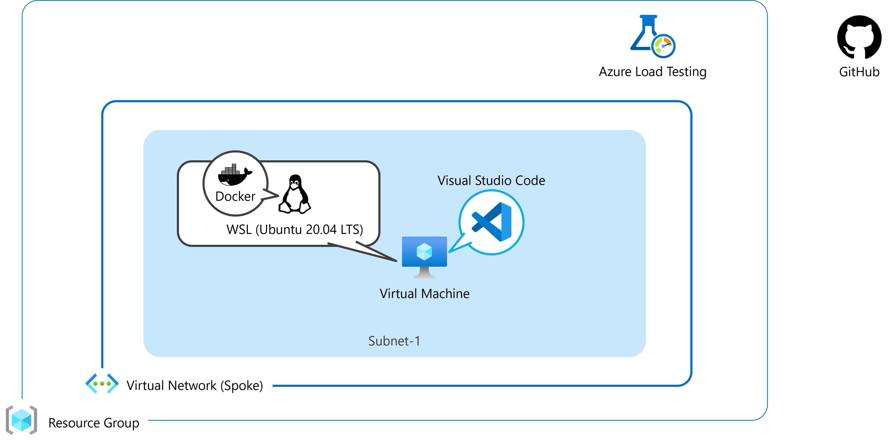

# AzureContainerApps-Hands-on-Lab-1

### 使用環境

 

### ディレクトリ構成
┣ .docker  
┃   ┣ CS (ASP.NET Core の dockerfile)  
┃   ┗ Java (Java アプリの dockerfile)
┣ .github
┃   ┗ workflows (ワークフロー ファイル)
┣ sample
┃   ┣ CS (C# の Docker, ワークフローのサンプル)  
┃   ┗ Java (Java の Docker, ワークフローのサンプル)
┣ src  
┃   ┣ CS (ASP.NET Core のソース コード)  
┃   ┗ Java (Java アプリのソース コード)
┣ templates (ARM テンプレート)  
┣ Before the HOL.md  
┣ HOL step-by-step Guide.md (ハンズオン手順書)  
┗ README.md